# Quantum Portfolio Optimization

## 1. Intro

**Comparing Markowitz's Portfolio Theory's optimization problem with Variational Quantum Eigensolvers (VQEs) and Quantum Approximation Optimization Algorithms (QAOA).**

This project surveys the approach in this paper: [Best Practices for PO by QC](https://www.nature.com/articles/s41598-023-45392-w), and [Benchmarking PO with QAOA](https://arxiv.org/pdf/2207.10555)

Portfolio optimization is a crucial task in finance, aiming to construct an optimal portfolio of assets that maximizes return while minimizing risk. Traditional methods often face limitations in handling constraints and large numbers of assets. But recent reseach has given us proof of concept of using quantum computing to solve the portfolio optimization problem: Lang J, Zielinski S, Feld S. Strategic Portfolio Optimization Using Simulated, Digital, and Quantum Annealing. Applied Sciences. 2022; 12(23):12288. https://doi.org/10.3390/app122312288. We can gain a real practical quantum advantage in the near-term that allows for better optimized portfolio from better estimates from the quadratic optimization problem.

Two prominant approaches are VQE and QAOA. Comparing these approaches will detail which approach will work at scale in NISQ and future FTQC devices. This work will evaluate the quality of results and resources needed of both methods to test their feasibility for a practical quantum advantage.

## 2. Background
### 2.1 Quadratic Formulation with Constriants
A portfolio is defined as the set of investments $x_i$ (measured as a fraction of the budget $B$) allocated for each *i*th asset of the market. 
The formulation of the Portfolio Optimization (PO) problem constrained under a budget is the quandratic objective function:
```math
\begin{equation}\begin{aligned}\underset{x}{\max }{\mathscr {L}}(x): \underset{x}{\max }(\mu ^{\text {T}} x - qx^{\text {T}}\Sigma x),\\ \text {s.t.} \quad \sum ^{N}_{i=1}x_i=1 \end{aligned}\end{equation}
```
Now considering $x$ is a possible solution to a problem with continous variables, the product $x_iB$ will be a multiple of $P_i$ - the closing price of the *i*th asset. To make to more computational feasable a subset of the problems where $x_iB$ is a integer multiple of $P_i$. A transformation of the variables $P,\ \mu,\ \Sigma,\text{ and } x$ will be necessary for the integer formulation:
```math
\begin{gathered} n = xB \\ P' = P/B \\ \mu'= P \circ \mu  && \text{where} \circ \text{is the Hadamard product} \\ \Sigma' = (P' \circ \Sigma)^T \circ P' \end{gathered}
```
```math
\begin{equation}\begin{gathered} \mathop {\max }\limits_{n} {\mathcal{L}}(n):\mathop {\max }\limits_{n} (\mu ^{{\prime {\text{T}}}} n - qn^{{\text{T}}} \Sigma ^{\prime } n), \\   {\text{s}}{\text{.t}}{\text{.}}\quad P^{{\prime {\text{T}}}} n = 1 \end{gathered}\end{equation}
```
*note: It is possible to extend this work to the case where the product $x_iB$ is continous, but the precision has to be limited. The approach will be detailed in [2.2.1](#221-converting-from-percent-to-binary)*

### 2.2 Converting Integer to Binary
To get the number of binary digits to have we first get the maximum number of integer units able to be bought within the budget each asset $n_i^{max}$ and the get the number of binary digits we take the log:
```math
\begin{equation}
\begin{gathered} 
    n^{max}_{i} = Int\left(\dfrac{B}{P_i}\right)  \\
    d_i = Int\left(\log_2{n_i^{max}}\right)
\end{gathered}
\end{equation}
```
We then get binarized target variables $b_i = [b_{1,0},\dots,b_{1,d_{1}},\dots,b_{N,0},\dots,b_{N,d_{N}}] \in R^{dim(b)}$, where $dim(b) = \sum\limits^N_{i=1}(d_i+1)$

Which helps define encoding matrix $C \in R^{N \times dim(b)}$, where N is the number of assets:
```math
C = \begin{pmatrix} 2^0 & \cdots & 2^{d_{1}} & 0 & \cdots & 0 & \cdots & 0 & \cdots & 0 \\ 0 & \cdots & 0 & 2^0 & \cdots & 2^{d_{2}} & \cdots & 0 & \cdots & 0\\ \vdots & \ddots & \vdots & \vdots & \ddots & \vdots & \ddots & \vdots& \ddots & \vdots \\ 0 & \cdots & 0 & 0 & \cdots & 0 & \cdots & 2^0 & \cdots & 2^{d_{N}} \end{pmatrix}
```
Which is used to further transform variables to be compatible with binary variables:
```math
\begin{gathered} \mu'' = C^T\mu' \\ \Sigma'' = C^T\Sigma'C \\ P''=C^TP' \end{gathered}
```
This results in the Quadratic Binary Optimization Problem:
```math
\begin{equation}\begin{gathered}   \mathop {\max }\limits_{b} {\mathcal{L}}(b):\mathop {\max }\limits_{b} \left( {\mu ^{{\prime \prime {\text{T}}}} b - qb^{{\text{T}}} \Sigma ^{{\prime \prime }} b} \right),  \\   {\text{s}}{\text{.t}}{\text{.}}\quad P^{{\prime \prime {\text{T}}}} b = 1 \\   \quad \quad b_{i}  \in \{ 0,1\} \quad \forall i \in \left[ {1, \ldots ,dim(b)} \right]. \end{gathered}\end{equation}
```
#### 2.2.1 Converting from Percent to Binary
My approach to converting a continous percentage of the budget $x_i$, if precision is limited two 2 decimal places then $x_i$ can be any integer from [0, 100]. Which would require 7 binary variables per asset. 
Ex:
- Given optimal percent of budget x_i for $i$th asset, 24%
- would be represented as 0011000 in the output string from measurement of the low-energy eigenstates from the Hamiltonian objective.


We then get binarized target variables $b_i = [b_{1,0},\dots,b_{1,d_{1}},\dots,b_{N,0},\dots,b_{N,d_{N}}] \in R^{dim(b)}$, where $dim(b) = 7*N$

Which helps define encoding matrix $C \in R^{N \times dim(b)}$, where N is the number of assets:
```math
C = \begin{pmatrix} 2^0 & \cdots & 2^{d_{1}} & 0 & \cdots & 0 & \cdots & 0 & \cdots & 0 \\ 0 & \cdots & 0 & 2^0 & \cdots & 2^{d_{2}} & \cdots & 0 & \cdots & 0\\ \vdots & \ddots & \vdots & \vdots & \ddots & \vdots & \ddots & \vdots& \ddots & \vdots \\ 0 & \cdots & 0 & 0 & \cdots & 0 & \cdots & 2^0 & \cdots & 2^{d_{N}} \end{pmatrix}
```

### 2.3 Quadratic Unconstrained Binary Optimization
To convert it to an unconstrained problem we transform the constrain into a penalty term in the objective function. Each constraint posed must have it's own penalty. The one in (4) becomes $\lambda(P''b-1)^2$:
```math
\begin{equation}\mathop {\max }\limits_{b} {\mathcal{L}}(b):\mathop {\max }\limits_{b} \left( {\mu ^{{\prime \prime {\text{T}}}} b - qb^{{\text{T}}} \Sigma ^{{\prime \prime }} b - \lambda (P^{{\prime \prime {\text{T}}}} b - 1)^{2} } \right).\end{equation}
```

### 2.4 Quantum Ising Hamiltonian 
To convert it into an Ising, related literature suggests expanding the components for ease of transformation:
```math
\begin{equation}\mathcal{L}(b):\sum\limits_{i} {\mu _{i}^{\prime } b_{i} }  - q\sum\limits_{{i,j}} {\Sigma _{{i,j}}^{\prime } } b_{i} b_{j}  - \lambda \left( {\sum\limits_{i} {P_{i}^{\prime } b_{i}  - 1} } \right)^{2}, \end{equation}
```
where $\mu'_i,\Sigma'_{i,j}, P'_i$ are components of $\mu_i'', \Sigma_i'', P''_i$, and $i \in [1,dim(b)].\\$ 
Now to convert into an Ising, spin variables $s_i$ which have values {-1,1}, are used in the transform $b_i \rightarrow \dfrac{1+s_i}{2}$. This results in a re-arrangement of the coefficients and gives:
```math
\begin{equation}\begin{gathered}\underset{s}{\min}\ {\mathscr {L}}(s): \underset{s}{\min }\left( \sum _{i}h_{i}s_{i}+ \sum _{i,j} J_{i,j}s_{i}s_{j}+\lambda (\sum _{i}(\pi _{i}s_{i}-\beta )^{2}\right)\\ \text {s.t.} \quad s_{i,j}\in \{-1,1\} \quad \forall i \nonumber,\end{gathered}\end{equation}
```
$J_{i,j}$ represents the coupling term between two spin variables.
We know that the eigenvalues of the Pauli Z operators are $\pm1$, which means it is suitable to represent the classical spin variables $s_i$. The two-body interaction can be represented through the tensor product of two Pauli Z Operators - $Z_i \otimes Z_{j}$.

The Qauntum Ising Hamiltonian:
```math
\begin{equation}\begin{gathered} \sum _{i}h_{i}Z_{i}+ \sum _{i,j} J_{i,j}Z_{i} \otimes Z_{j}+\lambda \sum _{i}(\pi _{i}Z_{i}-\beta )^{2}.\end{gathered}\end{equation}
```

## 3. Comparative Analysis
Given that analytical results of the performance of VQE and QAOA for a larger number of qubits is not available, current results will be extrapolated to evaluate their perfomance at scale. 

### 3.1 VQE method
VQE is a hybrid quantum-classical algorithm that leverages parameterized quantum circuits  (ansatz) to represent the trial state of the system. The algorithm iteratively refines the parameters using a classical optimizer to approximate the ground (minimum eigenstate) state of the Hamiltonian, which corresponds to the optimal portfolio.  

The VQE paper analyzes the impact of various hyperparameters, including ansatzes (TwoLocal, RealAmplitude, PauliTwo), optimizers (COBYLA, SPSA, NFT), and the penalty coefficient ($\lambda$). They recommend using the COBYLA optimizer, ansatzes with linear or pairwise entanglement, and a quantum computer with a large quantum volume for achieving optimal performance. The paper demonstrates the ability of VQE to obtain solutions close to the classical optimum with a strong convergence rate, even without error mitigation techniques, to showcase the potential of future FTQC devices. Also, it emphasizes the importance of considering hardware topology and quantum volume when selecting the ansatz structure.

### 3.2 QAOA Method
QAOA, another hybrid algorithm, combines classical and quantum components to solve combinatorial optimization problems. It operates by alternating between applying a problem Hamiltonian and a mixing Hamiltonian. The parameters of these Hamiltonians are adjusted to approximate the optimal solution. "The main limitation of QAOA is imposed by the exponential cost required for optimizing the variational parameters." [1] Yet strategies such as initalizing the state with values similar in pattern to the optimal parameters, provide a exponential reduction in optimization time. 

The QAOA paper explores various implementations with different mixers (standard, ring, parity ring, full, QAMPA) for portfolio optimization. They conclude that XY mixers, especially the full and QAMPA variants, outperform the standard mixer in achieving faster convergence and higher approximation ratios in ideal, noise-free simulations. The paper identifies asset correlation and return variance as key factors influencing problem difficulty, noting that instances with broader distributions are easier to optimize. However, the increased sensitivity of XY mixers to noise compared to the standard mixer highlights the importance of considering noise levels when selecting a QAOA variant.

### 3.3 Comparison
When comparing VQE and QAOA, both algorithms can achieve near-optimal solutions for portfolio optimization. In ideal scenarios, QAOA with XY mixers (full and QAMPA) exhibits faster convergence and potentially higher approximation ratios compared to VQE. However, VQE appears more robust against noise, particularly when using appropriate hyperparameter settings.

QAOA generally requires deeper circuits compared to VQE, especially with XY mixers, leading to increased susceptibility to noise and resource demands. In constrast, VQE can be implemented with simpler and shallower ansatzes, making it more suitable for NISQ devices with limited qubit counts and coherence times.

The potential for a practical quantum advantage with both VQE and QAOA hinges on overcoming the limitations of NISQ devices such as noise, qubit counts, and large-scale connectivity. Advancements in quantum hardware, error correction techniques, and the development of noise-resilient algorithms are crucial for realizing a practical quantum advantage. Additionally, exploring hybrid quantum-classical approaches that leverage error mititgation techniques provide a promising avenue for achieving practical quantum advantage with current NISQ era devices.

### 3.3 Graphs and other Results
VQE:
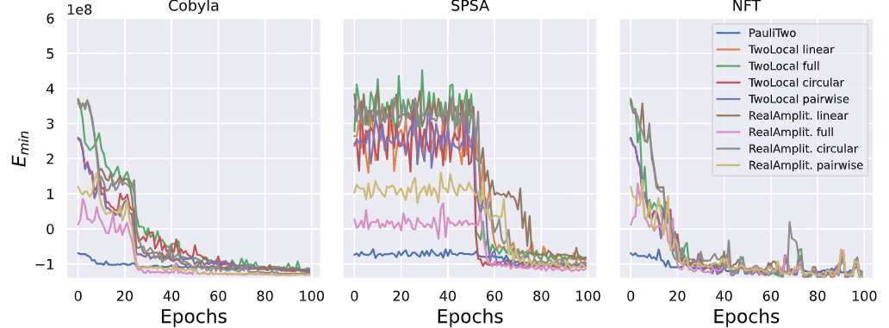
Fig. 2 [1]: Noiseless experiments performed on IBM QASM simulator, supposing a fault-tolerant quantum machine, with no quantum noise influencing the quality of the results. Convergence of the solutions towards the optimal one during training epochs, evaluated with different optimizers and different ansatzes. For all these experiments, a penalty term $\lambda$=10 was used.

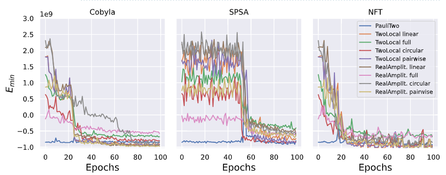
Fig. 3 [1]:Noisy experiments, performed on IBM QASM simulator, by importing IBM Cairo quantum computer noise model. Convergence of the solutions towards the optimal one during training epochs, evaluated with different optimizers and ansatzes. For all these experiments, a penalty term $\lambda$=10 was used.

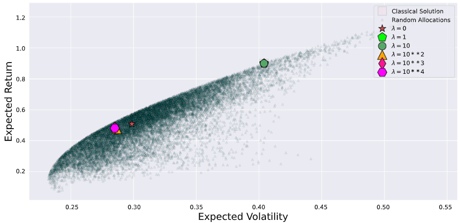
Fig. 4 [1]: Effect of variable penalty coefficient, used to transform the constrained into an unconstrained 
problem. Dots represent the random sampling of possible solutions satisfying the constraint of the continuous 
problem. Among them, a few are also possible solutions to the integer PO problem. The square corresponds 
to the optimal solution found by the classical branch-and-bound method. The other symbols correspond to 
the optimal solutions found to the QUBO problem, with constraints embedded in the objective function by 
setting different values of the penalty coefficient. For each penalty value, the evaluation of the best PO has been 
performed taking the average of 2000 runs from the quantum circuit optimized via the VQE.

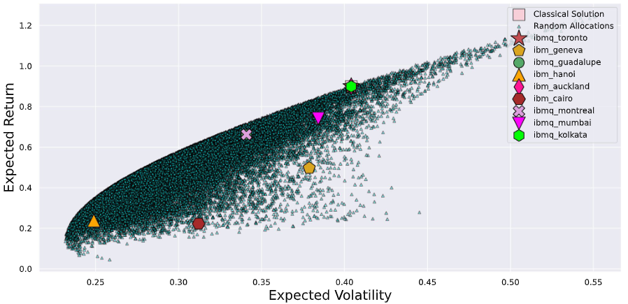
Fig. 5 [1]: Results of experiments run on different real quantum devices with $\lambda$=10. Dots represent the random sampling of possible solutions satisfying the constraint of the continuous problem. The square corresponds to the optimal solution found by the classical branch-and-bound method. The other symbols correspond to the optimal solutions found to the QUBO problem, by means of different IBM quantum computers. For each quantum hardware, the evaluation of the best PO has been performed taking the average of 2000 runs from the quantum circuit optimized via the VQE.

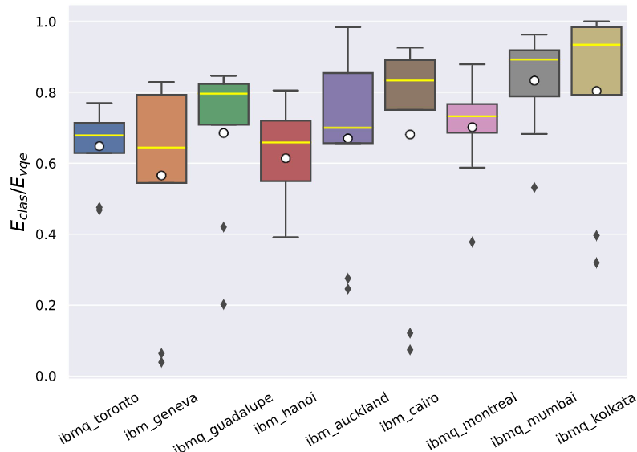
Fig. 6 [1]: Results of experiments run with the nine ansatz considered, on different real quantum devices, ordered according to growing quantum volumes. The box extends from the quartile Q1 to Q3 of the data, with a yellow line at the median ( Q2 ). The black lines extend from the edges of the box to show the range of the data. Here a standard approach is followed, as they extend to a maximum of $1.5∗$(Q3−Q1) from the edges of the box, ending at the farthest data point in the interval. Data outliers are plotted as black squares, while the white dots represent the mean of the result distribution for each hardware.

QAOA:
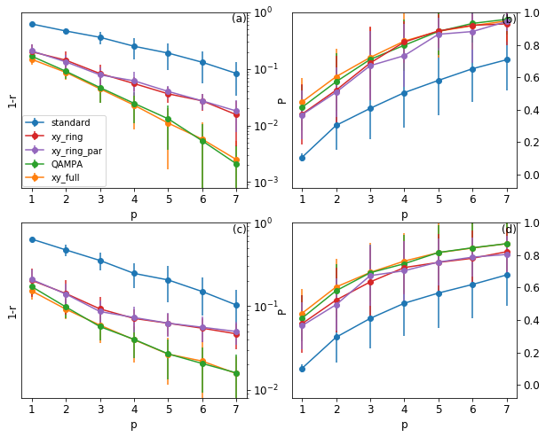
Fig. 2 [2]: (a) Mean deviation 1−r of the approximation ratio from the optimal solution
as a function of the QAOA depth p for 20 randomly chosen portfolio optimization
instances with n = 5 assets (and budget B = 2), using different mixers (see legend)
and the statevector simulator (without measurement noise). The error bars display
the standard deviation among the 20 random instances. The full XY mixer and
QAMPA (which requires less CNOT gates) show the fastest convergence towards
the optimal solution. (b) Mean probability P of obtaining the optimal portfolio with
standard deviation (error bars) as a function of QAOA depth p for the statevector
simulator. (c,d) Same as (a,b), but using the qasm simulator including measurement
noise due to a finite number of 1000 shots instead of the statevector simulator.
Significant differences with respect to the statevector simulator are only visible in
the vicinity of the optimal solution (r and P close to 1)

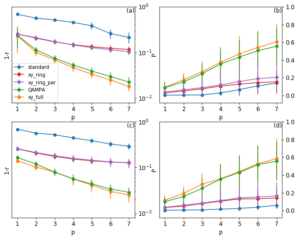
Fig. 3 [2]: Same as in Fig. 2 with ensemble of portfolio instances with n = 10 and budget
B = 5. The main conclusions, in particular concerning the superiority of the full XY
and the QAMPA mixer, are similar as in Fig. 

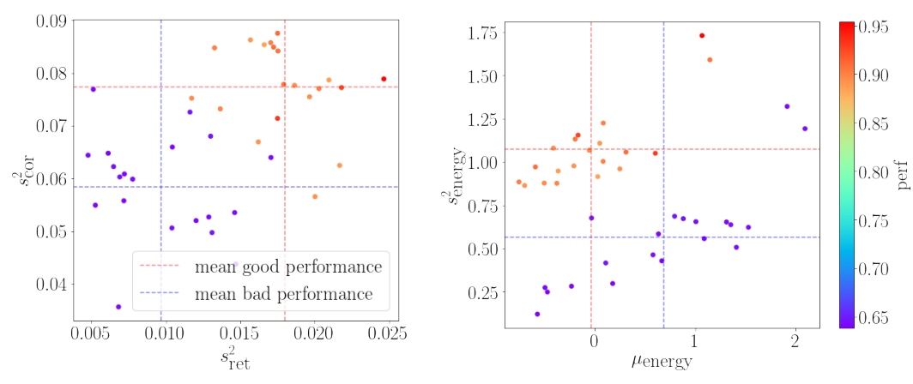
Fig. 4 [2]: Variance of returns $s^2_{ret}$ and normalized correlations $s^2_{cor}$ for instances of good/bad performance (left). Mean $\mu_{energy}$ and variance $s^2_{energy}$ of associated energy landscape (right).

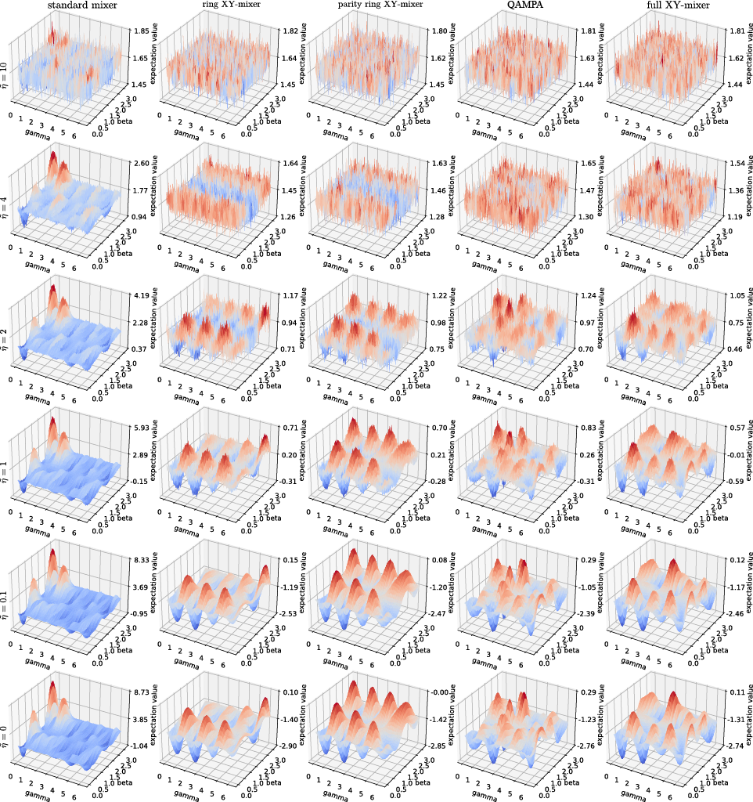
Fig. 5 [2]: Fig. 5 Expectation value of the investigated QAOA instance for the standard mixer, the ring XY-mixer, the parity ring XY-mixer, the QAMPA, and the full XY-mixer (from left to right) and noise strength $\tilde\eta$ ∈ {0, 0.1, 1, 2, 4, 10} (from bottom to top), where $\tilde\eta$ is the noise strength normalized by the size of the quantum computation, i.e. the number of quantum gates in the QAOA ansatz circuit

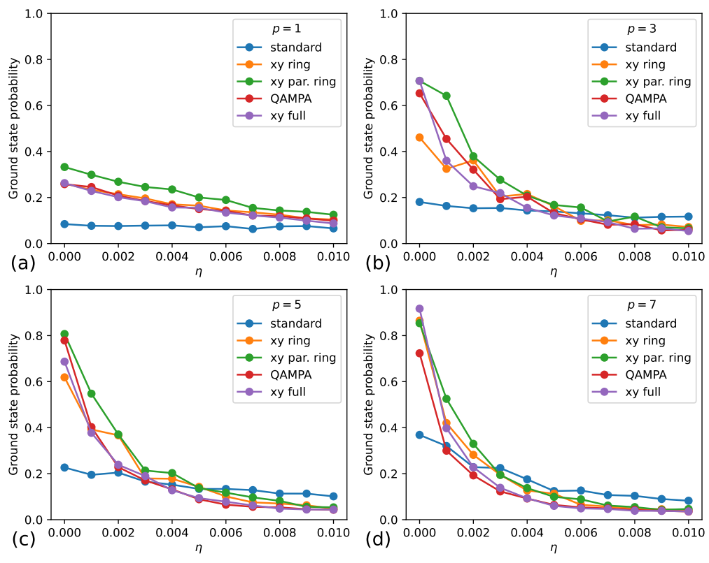
Fig. 6 [2]: The approximation ratio of the investigated QAOA instance as a function of depolarizing noise strength η for different mixers using a density matrix simulator with 8192 measurement samples. The classical optimizer COBYLA [23] was used.

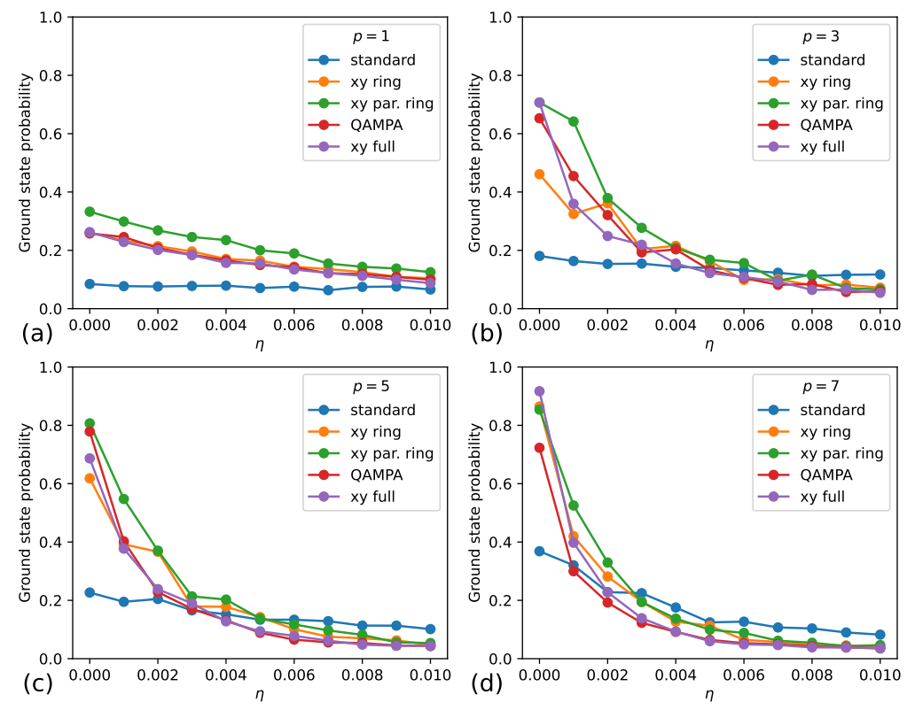
Fig. 7 [2]: The ground state probability of the investigated QAOA instance as a function of
depolarizing noise strength η for different mixers using a density matrix simulator with 8192 measurement samples. The classical optimizer COBYLA [23] was used.

## Code
https://github.com/NikashPrakash/Quantum-Portfolio-Optimization

## References
[1] Buonaiuto, G., Gargiulo, F., De Pietro, G. et al. Best practices for portfolio optimization by quantum computing, experimented on real quantum devices. Sci Rep 13, 19434 (2023). https://doi.org/10.1038/s41598-023-45392-w

[2] Amaro, D., Rosenkranz, M., Fitzpatrick, N. et al. A case study of variational quantum algorithms for a job shop scheduling problem. EPJ Quantum Technol. 9, 5 (2022). https://doi.org/10.1140/epjqt/s40507-022-00123-4

[3] Brandhofer, Sebastian. “Benchmarking the Performance of Portfolio Optimization with QAOA.” Arxiv, 2022, https://arxiv.org/pdf/2207.10555.pdf. 
